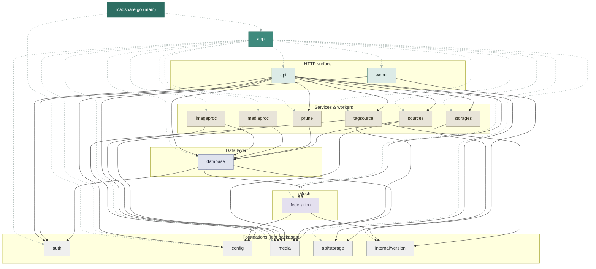

# Package dependency graph

All packages of the `daemonlord.ygg/madshare` module and every internal import
edge between them, generated from `go list`. Arrows point from importer to
imported. Regenerate after structural changes (command at the bottom).

Generated 2026-08-08 with the default build tags, so `federation` and `webui`
are included; a `nofederation`/`nowebui` build drops those nodes and their
edges. Test-only imports are not shown.

## The graph



The dashed grey edges are the **composition** edges — `app` wires every package
together and `madshare.go` is a shim over `app`
(`docs/architecture/embedding.md`), so those 16 edges carry no structural
information. The solid edges are the ones worth reading.

## How to read it

The layering is strict — there are no import cycles, and nothing below ever
imports upward:

- **`app`** — the composition root: it owns startup and shutdown and is the only
  package that touches every layer. `main` imports it and almost nothing else,
  which is what lets an embedder run the same startup the server does
  (`docs/architecture/embedding.md`).
- **HTTP surface** — `api` is the router hub. `webui` is deliberately thin (it can
  be compiled out via `nowebui`, which only works because its edges are so few).
- **Mesh** — `federation` sits *below* `database` as well as beside `api`: it owns
  the embedded node, but it also defines the madnetwork vocabulary the queries are
  written in (`Audience`, scopes, peer/source types), which is why the data layer
  imports it. Compiled out via `nofederation`. Its own edges are only `config` and
  `internal/version`, so it stays cheap to depend on.
- **Services & workers** — background pools and maintenance jobs. Each touches
  only `database`, `media`, and the small foundation packages.
- **Data layer** — `database` is the single funnel to SQLite; its three downward
  edges (`auth` for the store types, `media` for the tag structs, `federation` for
  the madnetwork types) are type dependencies, not logic.
- **Foundations** — pure leaf packages with zero internal imports. Safe to
  change in isolation; everything above may break, nothing below can.

## Packages at a glance

| Package            | Role                                                                | Imported by |
|--------------------|---------------------------------------------------------------------|------------:|
| `app`              | startup/shutdown + the embedder facade (Start/Serve/Stop, Library)  | 1 |
| `api`              | chi router, all HTTP endpoints (browse, upload, admin, moderation)  | 1 |
| `webui`            | embedded HTML/JS/CSS web interface (build tag `nowebui`)            | 1 |
| `federation`       | embedded madnetwork node + the shared mesh types (tag `nofederation`) | 3 |
| `imageproc`        | cover-image resize worker pool                                      | 1 |
| `mediaproc`        | ffprobe/fpcalc analysis worker pool, recording resolution           | 1 |
| `prune`            | background prune job manager (singleton)                            | 2 |
| `sources`          | import-in-place symlink sources, rescan                             | 2 |
| `storages`         | blob storage registry (local, links)                                | 2 |
| `tagsource`        | tag suggestions: ID3 blocks, AcoustID/MusicBrainz                   | 2 |
| `database`         | SQLite repository + embedded migrations (the only DB gateway)       | 6 |
| `auth`             | passwords, sessions, tokens, RBAC middleware — leaf                 | 4 |
| `config`           | TOML config load + validation — leaf                                | 4 |
| `media`            | tag extraction, analysis, fingerprints — leaf                       | 7 |
| `api/storage`      | shared storage types — leaf                                         | 3 |
| `internal/version` | build-time version stamp — leaf                                     | 3 |

## Regenerating

The edge list comes straight from the Go toolchain:

```bash
go list -f '{{$p := .ImportPath}}{{range .Imports}}{{$p}} {{.}}{{"\n"}}{{end}}' ./... \
  | grep ' daemonlord.ygg/madshare'
```

Update the Mermaid edge list (and the date above) to match the output, drop the
`daemonlord.ygg/madshare/` prefix from node names, and keep `main`'s edges
first so the `linkStyle` dashed-grey range still covers exactly them.
